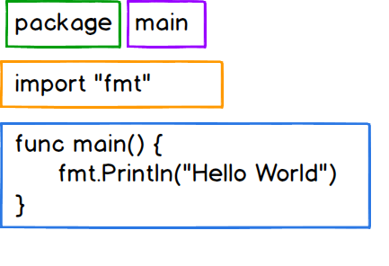

# Hello World

> Deskripsi dalam progres

## Struktur kode

### Package
Dari namanya saja kita bisa artikan bahwa **package = paket** atau bisa juga diibaratkan seperti box / kotak, **package** dapat ditemui baris pertama program.

**package** berfungsi sebagai penanda bahwa file / program Go tersebut termasuk dalam ke dalam package yang mana.
Dalam kasus ini, kita memakai `package main` dimana file tersebut termasuk ke dalam **package main**.

Keyword **package** wajib ada disetiap program Go, mengapa ? seperti yang sudah kita bahas diatas , bahwa package digunakan sebagai penanda. Go akan mencari keyword **package** dan mengelompokan program tersebut sesuai dengan nama package nya.

kita akan bahas lebih dalam tentang package di chapter packages.

### Import

Import ini berguna untuk mengunakan paket lain, seperti file go dalam folder lain, paket pustaka standar dan paket pustaka pihak ke-3.

### func Main()

fungsi main adalah fungsi yang akan dipanggil pertama kali (entry point) saat program dijalankan.
maka seluruh kebutuhan program untuk berjalan harus di panggil oleh fungsi main agar berjalan.
